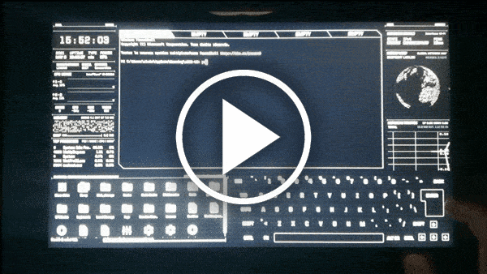
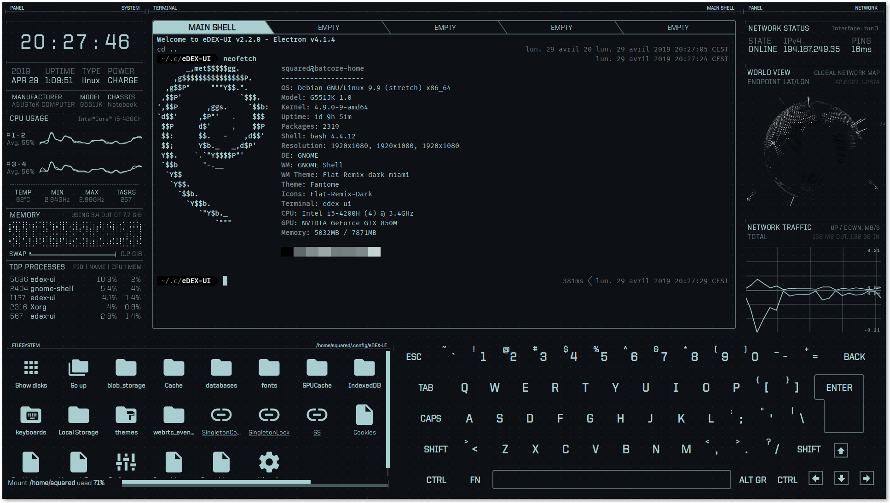
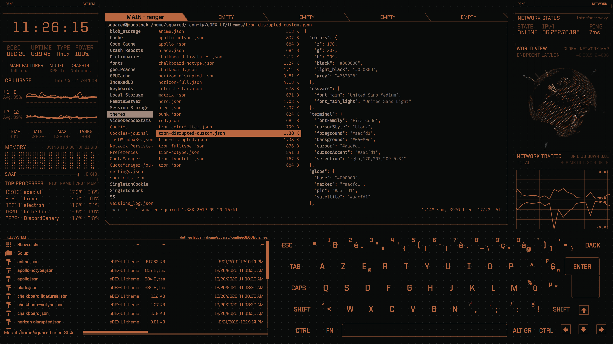
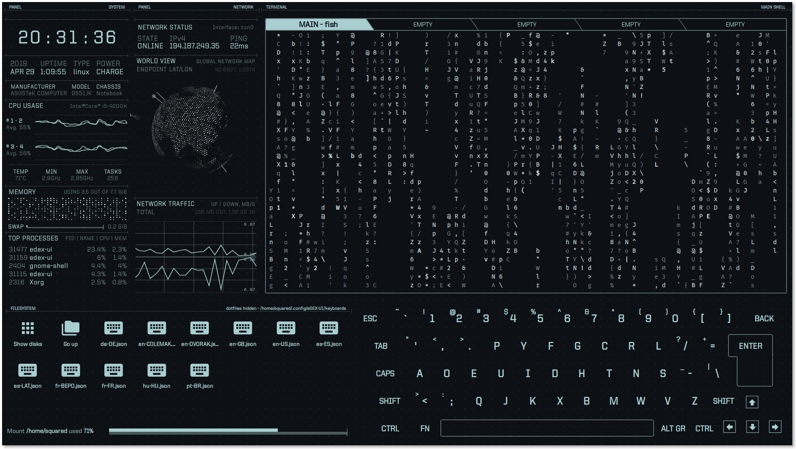
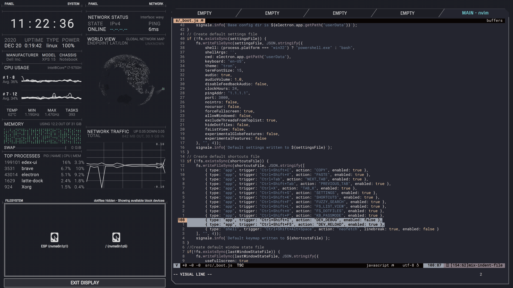

<p align="center">
  <br>
  
  <br><br>
  <a href="https://github.com/lightyagami28/edex-ui/releases/latest"></a>
  <a href="#featured-in"></a>
  <a href="https://github.com/lightyagami28/edex-ui/blob/master/LICENSE"></a>
  <br>
  <a href="https://github.com/lightyagami28/edex-ui/actions/workflows/build-binaries.yaml"></a>
  <a href="https://github.com/lightyagami28/edex-ui/actions/workflows/vulnerability-scan.yml"></a>
  <a href="https://github.com/lightyagami28/edex-ui/actions/workflows/codeql-analysis.yml"></a>
  <br><br>
  <a href="https://github.com/lightyagami28/edex-ui/releases/latest/download/eDEX-UI-Windows.exe" target="_blank"></a>
  <a href="https://github.com/lightyagami28/edex-ui/releases/latest/download/eDEX-UI-macOS.dmg" target="_blank"></a>
  <a href="https://github.com/lightyagami28/edex-ui/releases/latest/download/eDEX-UI-Linux-x86_64.AppImage" target="_blank"></a>
  <a href="https://github.com/lightyagami28/edex-ui/releases/latest/download/eDEX-UI-Linux-arm64.AppImage" target="_blank"></a>
  <a href="https://aur.archlinux.org/packages/edex-ui" target="_blank"></a>
  <br><br><br>
</p>

<p align="center"><strong>eDEX-UI</strong> is a fullscreen, cross-platform terminal emulator and system monitor that looks and feels like a sci-fi computer interface.</p>

> **This is an actively maintained fork** of the archived [GitSquared/edex-ui](https://github.com/GitSquared/edex-ui). Dependencies, CI/CD and security scanning are kept current here — see [Security & Dependency Monitoring](#security--dependency-monitoring) and the [Fork Changelog wiki page](https://github.com/lightyagami28/edex-ui/wiki/Fork-Changelog) for what's changed.

---

<a href="https://youtu.be/BGeY1rK19zA">
  
</a>

Heavily inspired by the [TRON Legacy movie effects](https://web.archive.org/web/20170511000410/http://jtnimoy.com/blogs/projects/14881671) (especially the [Board Room sequence](https://gmunk.com/TRON-Board-Room)), eDEX-UI was originally meant to be *"[DEX-UI](https://github.com/seenaburns/dex-ui) with less « art » and more « distributable software »"*.

It keeps a futuristic look and feel while remaining usable in real-life scenarios — a joke taken seriously enough to double as your daily terminal.

<br clear="right">

---

<p align="center">
  <em>Jump to: <a href="#features">Features</a> — <a href="#screenshots">Screenshots</a> — <strong><a href="#getting-it">Download</a></strong> — <a href="#running-from-source">Source</a> — <a href="#security--dependency-monitoring">Security</a> — <a href="#qa">Q&A</a> — <a href="#featured-in">Featured In</a> — <a href="#credits">Credits</a></em>
</p>

## Features

- Fully featured terminal emulator with tabs, colors, mouse events, and support for `curses` and `curses`-like applications.
- Real-time system monitoring: CPU, RAM, swap, processes, hardware info (manufacturer/model/chassis).
- Real-time network monitoring: GeoIP location, active connections plotted on a 3D globe, transfer rates.
- Full support for touch-enabled displays, including an on-screen keyboard with per-layout key remapping.
- Directory viewer that follows the terminal's current working directory, with a fuzzy-search file finder (`Ctrl+Shift+F`).
- Built-in PDF viewer and audio/video player, opened straight from the directory viewer.
- Deep customization via themes, on-screen keyboard layouts, and CSS injections — see the [Configuration wiki page](https://github.com/lightyagami28/edex-ui/wiki/Configuration).
- Optional sound effects for maximum hollywood-hacking vibe.

## Screenshots


*[neofetch](https://github.com/dylanaraps/neofetch) on the default "tron" theme & QWERTY keyboard*


*Browsing themes in [eDEX's config dir](https://github.com/lightyagami28/edex-ui/wiki/Configuration) with [`ranger`](https://github.com/ranger/ranger), "blade" theme*


*[cmatrix](https://github.com/abishekvashok/cmatrix) on the experimental "tron-disrupted" theme, user-contributed DVORAK keyboard*


*Editing eDEX-UI source with `nvim`, custom [`horizon-full`](https://github.com/GitSquared/horizon-edex-theme) theme*

## Getting it

Click a download badge above, grab a build from the [Releases](https://github.com/lightyagami28/edex-ui/releases) page, or install through [one of the available package repositories](https://repology.org/project/edex-ui/versions) (Homebrew, AUR, ...).

Release binaries are unsigned ([why](https://gaby.dev/posts/code-signing)) — on Linux, `chmod +x` the AppImage before running it.

Want the bleeding edge instead of a tagged release? Every push builds fresh binaries on [GitHub Actions](https://github.com/lightyagami28/edex-ui/actions) — open the latest run and download the artifact for your OS.

## Running from source

```sh
git clone https://github.com/lightyagami28/edex-ui.git
cd edex-ui
npm run install-linux   # or install-windows (as Administrator)
npm run start
```

Requires **Node.js ≥ 22.12** (developed against Node.js 26.7.0). Full requirements, build commands for distributable binaries, and troubleshooting live in the [Building from source wiki page](https://github.com/lightyagami28/edex-ui/wiki/Building-from-source).

## Security & Dependency Monitoring

This repository runs **24/7 automated vulnerability monitoring**:

- **Dependabot** — daily dependency update PRs
- **Daily vulnerability scans** — `npm audit` on every dependency tree
- **Advanced security scanning** — Snyk, Trivy, OSV and OWASP Dependency-Check, every 6 hours
- **CodeQL** — static analysis 3×/week
- **SonarQube** — code quality/security on every push and PR
- Critical findings automatically open a GitHub issue and gate PRs

Dashboards: [Security Advisories](../../security/advisories) · [Dependabot Alerts](../../security/dependabot) · [Security Status](.github/SECURITY_STATUS.md) · full details in [SECURITY_MONITORING.md](SECURITY_MONITORING.md) · report a vulnerability via [SECURITY.md](SECURITY.md).

## Q&A

### I have a problem

Search [Issues](https://github.com/lightyagami28/edex-ui/issues) first. If it's not reported yet, open a new one. If your issue is closed already, the fix likely ships in the next version.

### Can you disable the keyboard/the filesystem display?

Not yet, but you can hide them — see the `tron-notype` theme.

### Why is the file browser saying "Tracking Failed"? (Windows only)

On Linux/macOS, eDEX tracks the terminal's working directory to mirror it in the file browser. That's not implemented for Windows yet, so the file browser falls back to a "detached" mode — you can still browse and click files to insert their path into the terminal.

### Can this run on a Raspberry Pi / ARM device?

Prebuilt arm64 builds are provided. For other ARM variants see [this issue comment](https://github.com/GitSquared/edex-ui/issues/313#issuecomment-443465345) and [#818](https://github.com/GitSquared/edex-ui/issues/818).

### Is this repo actively maintained?

The original upstream project ([GitSquared/edex-ui](https://github.com/GitSquared/edex-ui)) was archived after a 3-year run — see the [announcement](https://github.com/GitSquared/edex-ui/releases/tag/v2.2.8). **This fork keeps it alive**: dependencies, CI/CD and security scanning are actively maintained here.

### How did you make this?

See [#272](https://github.com/GitSquared/edex-ui/issues/272) on the original repo.

<p align="center"></p>

## Featured in

- [Linux Uprising Blog](https://www.linuxuprising.com/2018/11/edex-ui-fully-functioning-sci-fi.html)
- [r/unixporn](https://www.reddit.com/r/unixporn/comments/9ysbx7/oc_a_little_project_that_ive_been_working_on/)
- [Korben (French)](https://korben.info/une-interface-futuriste-pour-vos-ecrans-tactiles.html)
- [Hacker News](https://news.ycombinator.com/item?id=18509828)
- [BoingBoing](https://boingboing.net/2018/11/23/simulacrum-sf.html)
- [O'Reilly 4 short links](https://www.oreilly.com/ideas/four-short-links-23-november-2018) ([again](https://www.oreilly.com/radar/four-short-links-7-july-2020/))
- [Hackaday](https://hackaday.com/2018/11/23/look-like-a-movie-hacker/)
- [Developpez.com (French)](https://www.developpez.com/actu/234808/Une-application-de-bureau-ressemble-a-une-interface-d-ordinateur-de-science-fiction-inspiree-des-effets-du-film-TRON-Legacy/)
- [GitHub Blog's Release Radar, Nov. 2018](https://blog.github.com/2018-12-21-release-radar-november-2018/)
- [opensource.com](https://opensource.com/article/19/1/productivity-tool-edex-ui)
- [LinuxLinks](https://www.linuxlinks.com/linux-candy-edex-ui-sci-fi-computer-terminal-emulator-system-monitor/)
- [Linux For Everyone (YouTube)](https://www.youtube.com/watch?v=gbzqCAjm--g)
- [BestOfJS Rising Stars 2020](https://risingstars.js.org/2020/en#edex-ui)
- [The Geek Freaks (YouTube/German)](https://youtu.be/TSjMIeLG0Sk)
- [JSNation Open Source Awards 2021](https://osawards.com/javascript/#nominees) (Nominee, Fun Side Project of the Year)

## Credits

eDEX-UI's source code was primarily written by [Squared](https://github.com/GitSquared) — [website](https://gaby.dev) · [Twitter](https://gaby.dev/twitter).

[PixelyIon](https://github.com/PixelyIon) helped with Windows compatibility. [IceWolf](https://soundcloud.com/iamicewolf) composed the sound effects (v2.1.x+).

eDEX wouldn't exist without [Seena](https://github.com/seenaburns)'s original work on [r/unixporn](https://reddit.com/r/unixporn). See the [full dependency graph](https://github.com/lightyagami28/edex-ui/network/dependencies) — particular thanks to the developers of [xterm.js](https://github.com/xtermjs/xterm.js), [systeminformation](https://github.com/sebhildebrandt/systeminformation) and [SmoothieCharts](https://github.com/joewalnes/smoothie), and to [Rob "Arscan" Scanlon](https://github.com/arscan) for the freely-distributed [ENCOM Globe](https://github.com/arscan/encom-globe).

### Sponsor

Want to support open-source experiments like this one? [Sign up to Bytes](https://ui.dev/bytes/?r=gabriel), the newsletter cool enough to be recommended by eDEX-UI.

## License

[GPLv3.0](https://github.com/lightyagami28/edex-ui/blob/master/LICENSE)
